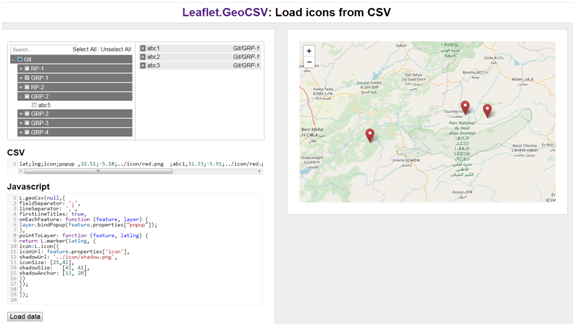
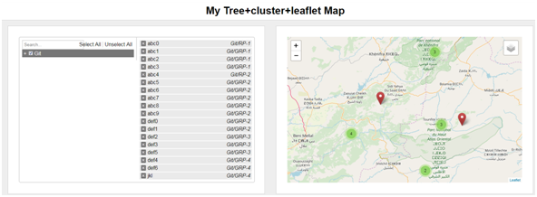

# Leaflet-GeoCSV-tree-multiselect-cluster
integration of tree-multiselect.js and Leaflet GeoCSV in index.html demo: http://mtabdar.github.io/proj1/index.html

 
in index2.html cluster is also added demo is here : http://mtabdar.github.io/proj1/index2.html

 
both files can be used locally without the need for server
